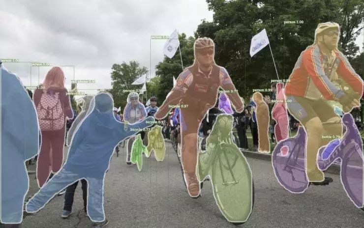
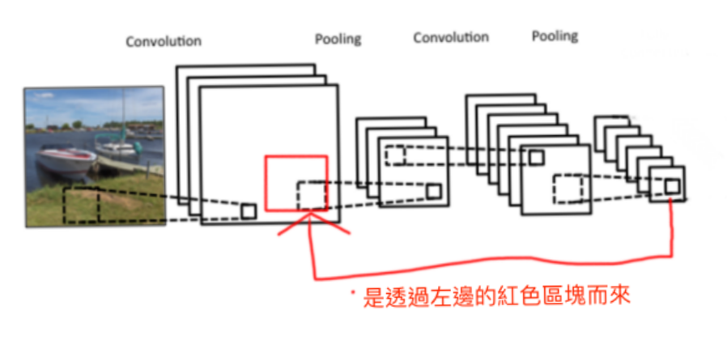
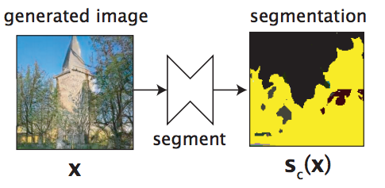
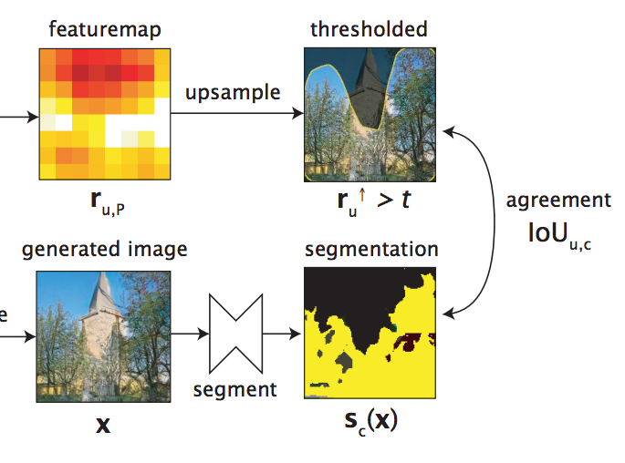
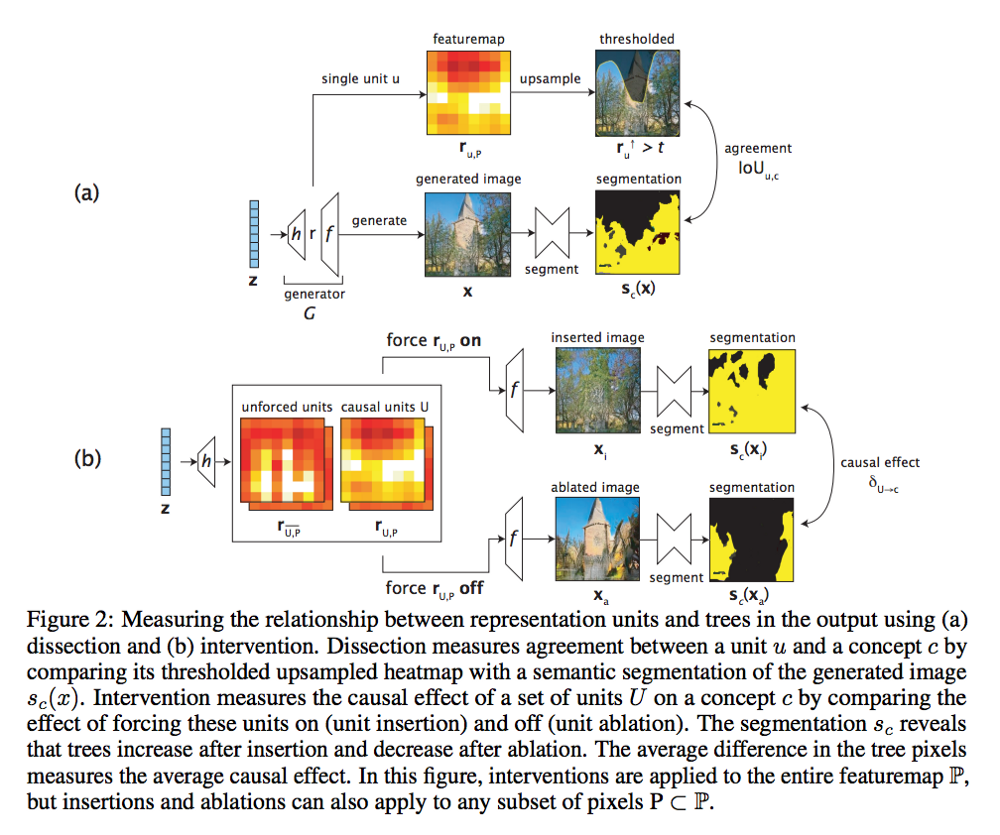
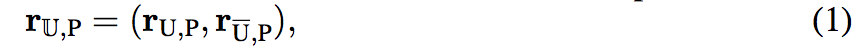
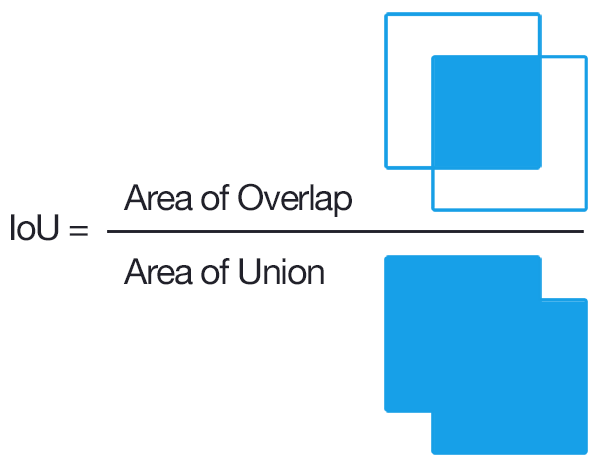
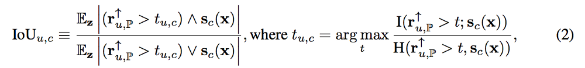

#HW3-GAN-Dissection

## To-Do

1.  使用GANPaint產生圖片
2.  Dissect any GAN model and analyze what you find
3.  Compare with other method


## 1.使用GANPaint產生圖片
## GANDissect介紹 <a href="http://gandissect.res.ibm.com/ganpaint.html?project=churchoutdoor&layer=layer4"></a>

[**專案**](https://gandissect.csail.mit.edu/) | [**Demo**](http://gandissect.res.ibm.com/ganpaint.html?project=churchoutdoor&layer=layer4) | [**論文**](https://arxiv.org/pdf/1811.10597.pdf) | [**影片**](http://tiny.cc/gandissect) <br>

[GAN Dissection](https://gandissect.csail.mit.edu/) is a way to inspect the internal representations of a generative adversarial network (GAN) to understand how internal units align with human-interpretable concepts. It is part of [NetDissect](https://netdissect.csail.mit.edu/).

This repo allows you to dissect a GAN model. It provides the dissection results as a static summary or as an interactive visualization. Try our interactive [GANPaint demo](http://gandissect.res.ibm.com/ganpaint.html?project=churchoutdoor&layer=layer4) to interact with GANs and draw images. 

這個工具是非常有趣的demo，只要鼠標劃過，GAN就可以立即在你指定的地方畫出雲彩、草地、門和樹等景物，並直接改變構圖以保持圖像的「合理性」。選中「draw」功能和特定的對象，如tree，就能在圖中隨意用畫筆塗抹，GAN會在塗抹區域自動生成樹木。選中「remove」功能和特定的對象，如grass，GAN會在塗抹區域自動刪除草地。

GAN paint app的工作原理是直接激活或者去激活深度網絡中的神經元組，這些神經元被訓練用來生成圖像。左邊每個按鈕（如door、brick等）都對應20個神經元。該app表明，通過學習繪畫，GAN網絡還能學習樹、門還有屋頂等對象。通過直接切換神經元，你可以觀察該網絡建模的視覺世界的結構。

我們使用了這個GANPaint工具來玩幾個樣式：

### 樣式1
如最左是我們原始圖片，我們實驗了 addTrees_addGrass, addTrees, addsky, addDome 幾個結果。

### 樣式2
如最左是我們原始圖片，我們實驗了 addGrass_addDoors_addDomes,addGrass_addDoors, addGrass, addsky 幾個結果。

### 樣式3
如最左是我們原始圖片，我們實驗了 removesDomes_addTrees_addGrass_addClouds,removeBricks_addClouds, addGrass_addtrees 幾個結果。


**結論：我們在實驗過程發現，只要是相關性高的元素，Ganpiant會給我們最佳的繪圖效果，例如，當我們要在草地上加樹時，生成的效果最大，但是如果我們要在天空增加樹林，效果生成就不會太大，但是在天空加入雲效果就會非常的好：**


## 2.Dissect any GAN model and analyze what you find
## 大綱介紹


[Visualizing and Understanding Generative Adversarial Networks](http://gandissect.csail.mit.edu) <br>
[David Bau](http://people.csail.mit.eduÂ/davidbau/home/), [Jun-Yan Zhu](http://people.csail.mit.edu/junyanz/), [Hendrik Strobelt](http://hendrik.strobelt.com/), [Bolei Zhou](http://people.csail.mit.edu/bzhou/), [Joshua B. Tenenbaum](http://web.mit.edu/cocosci/josh.html), [William T. Freeman](https://billf.mit.edu/), [Antonio Torralba](http://web.mit.edu/torralba/www/) <br>
MIT CSAIL, MIT-IBM Watson AI Lab, CUHK, IBM Research <br>
In arXiv, 2018.

## 開始安裝（本專案使用church_Outdoor model示範）
Let's set up the environment and dissect a `churchoutdoor` GAN. This requires some CUDA-enabled GPU and some disk space.

### 安裝步驟

To install everything needed from this repo, have `conda` available,
and run:

```
script/setup_env.sh      # Create a conda environment with dependencies
script/make_dirs.sh      # Create the dataset and dissect directories
script/download_data.sh  # Download support data and demo GANs
source activate netd     # Enter the conda environment
pip install -v -e .      # Link the local netdissect package into the env
```

Details.  The code depends on python 3, Pytorch 4.1, and several other
packages.  For conda users, `script/environment.yml` provides the details
of the dependencies.  For pip users, `setup.py` lists everything needed.

Data.  The `download_data.sh` script downloads the segmentation dataset
used to dissect classifiers, the segmentation network used to dissect GANs,
and several example GAN models to dissect.  The downloads will go into
the directories `dataset/` and `models/`.  If you do not wish to download
the example networks, `python -m netdissect --download` will download
just the data and models needed for netdissect itself.


### Dissecting a GAN（我們使用churchoutdoor_model）

GAN example: to dissect three layers of the LSUN living room progressive
GAN trained by Karras:

```
python -m netdissect \
   --gan \
   --model "netdissect.proggan.from_pth_file('models/karras/livingroom_lsun.pth')" \
   --outdir "dissect/livingroom" \
   --layer layer1 layer4 layer7 \
   --size 1000
```

The result is a static HTML page at `dissect/livingroom/dissect.html`, and
a JSON file of metrics at `dissect/livingroom/dissect.json`.

You can test your own model: the `--model` argument is a fully-qualified
python function or constructor for loading the GAN to test.  The
`--layer` names are fully-qualified (`state_dict`-style) names for layers.

By default, a scene-based segmentation is used but a different segmenter class
can be substituted by supplying an alternate class constructor to
`--segmenter`.  See `netdissect/segmenter.py` for the segmenter base class.

## Running a GAN editing server (alpha)


Once a GAN is dissected, you can run a web server that provides an API
that generates images with (optional) interventions.

```
python -m netdissect.server --address 0.0.0.0
```


The editing UI (right) is served at [http://localhost:5001/](http://localhost:5001/) .

Other URLs:

- [http://localhost:5001/api/ui](http://localhost:5001/api/ui) is the OpenAPI/swagger UI for directly
    testing GAN interventions.
- [http://localhost:5001/data/livingroom/dissect.html](http://localhost:5001/data/livingroom/dissect.html) static net
    dissection reports.
- [http://localhost:5001/data/livingroom/edit.html](http://localhost:5001/data/livingroom/edit.html) a dissection-based
    interface for testing interventions.
- TODO: [http://localhost:5001/ganpaint.html](http://localhost:5001/ganpaint.html) will serve GANpaint

成功啟動church_outdoor_model，我們來分析layer1, layer4, layer7 結果IoU（Area of Overlap / Area of Union）狀況：

### layer1層分析
如下圖，我們分析出layer1層的IoU的狀況，在grass及tree兩張圖，ioa的錯誤率是蠻大的，這是因為第一層的狀況仍未訓練出好的參數，導致錯誤率發生極大。


### layer4層分析
如下圖，我們分析出layer4層的IoU的狀況，除了tree其中一張圖沒找到符合的元素外，ioa的情況其實訓練得非常好，幾乎可以找得到我們要的target。


### layer7層分析
如下圖，整體的IoU表現的非常好，該有的目標都有達到（tree, cloud, grass, sky, window），訓練生成的目標達到我們的期望（優於layer1 及 layer4）


### 整體分析表現

|  層數 |layer1層 | layer4層 | layer7層
| ---  |--- | --- | --- |
|效果   |poor | medium | **best**
|正確率 |15% | 70% | 99%  （計算方式：正確張數/總張數）
## 3.  Compare with other method（Detectron method）

Detectron 在 2018 年初被發布時，Facebook 團隊用這個平台訓練自定義模型，並把它們用在增強現實、社區完整性等各種各樣的任務中。在 Detectron 中訓練完畢的模型可以直接通過高效的 Caffe 2  運行時部署在雲服務器和移動設備上，Detectron  的 GitHub  項目中還帶有超過 70 個預訓練的基準模型可以用於性能對比。Detectron 在背後支持的算法為實例分割之類的重要計算機視覺任務提供了直觀的模型，也在視覺感知系統這一整個研究社區的研究重點近幾年的飛速發展中起到了重要作用。如下圖所示所示（偵測照片上的人群）：



## 優缺點比較

同樣是找IoU的判別，但是facebook的演算法，在找obejct部分整體訓練速度來得GAN Dissecting快，同樣是輕量化的架構，GAN Dissecting使用pytorch輕量化框架，而Detectron則是用caffee2，但是由於facebook有加入加速器演算法，所以整體效能來說，會快一些。


|  內容 | GAN Dissecting   | Detectron 
| ---   |--- | ---  
|效能   |慢 | 快 | 
|正確率 |99% | 99%  


## 補充（論文原理介紹）
概念：我們可以知道CNN是有所謂的空間相關係。

那我們經過上面這個示意圖能夠知道，每個 pixel（Feature map） 都是對應到前面 Feature map 的某區域。

先講結論：如果該 Unit 與某個類別是相關的，那麼其 Feature map(想像成熱力圖)會與語意分割後該類別的 Mask 相似。

透過語意分割模型將特定的類別切割出來，下圖將樹(Tree)的部分切割出來。



接下來我們再將某個 Unit 的 Feature map 與其分割出的 Mask 做比對，看看相不相似，下圖為此論文架構的一部分。透過這方式一一比對，當 Feature map 與某個類別的 Mask 長得夠像的時候，我們可以認定這個 Unit 與某類別之間是有較大關聯性的。



透過上面的方式，我們能夠知道哪些 Unit 與某類別是相關的，但是我們卻不知道更動這些 Unit 的 Feature map 與最終產生出來的圖片(Output)有什麼關聯。

可能這個 Unit 與該類別雖然有關聯，但是實際上對產生出來的圖片影響不大，透過這個方式我們可以將其類別的 Unit 進行排序，排名(Rank)出對其類別最有影響力的 Unit，此實驗是對每個類別取 1…n（n=20） Units。我們要先透過 Dissection 得知哪些 Unit 是與該類別相關，再經由 Intervention 明白改動這個 Unit 到底對最終輸出的該類別有著多大的影響。因此我認為 Dissection 與 Intervention 的關係可以用 “方向” 與 “能量大小” 的關係作比喻。

如下圖：上半部為 Dissection 解開，下半部為 Intervention 介入



先看 G 的架構，對於圖像生成的任務，通常會輸入雜訊 z，然後生成圖片 x，而之所以可以生成 x 是因為 z 再經過一層一層的 layer 慢慢的轉變成圖片，

這邊的想法是我們提取出第 r 層，來探討他每個 Unit 的 Feature map，而他的 Feature map 會繼續影響著後續的 f(layers) 最終生成圖片。

而我們的最終目的是希望找出哪些 Unit 是對結果有顯著影響的。

這邊我們可以這樣想像，假設我們要生出辦公室的場景，那可能有些 Unit 各自負責桌子、椅子、人。但是剛好這張圖片生成出來後，只有桌子和椅子，我們希望找到著重於桌子和椅子的 Unit，這樣就能對他做移除/修改的動作。因此我們定義下面這公式

參數定義：
- r : 某層 Layer， 可看架構圖 generator(G) 的部分
- U : 哪些 Unit 是對目前想要操作的類別有影響的，舉例我可能想要修改椅子而已，我們要找出哪些 units 對椅子有影響。
- U- : U 的補數，即為我們不感興趣的 units.







## Acknowledgments
Code is from [gandissect](https://github.com/CSAILVision/GANDissect). All credit goes to the authors of [gandissect](https://gandissect.csail.mit.edu/), David Bau, Jun-Yan Zhu, Hendrik Strobelt, Bolei Zhou, Joshua B. Tenenbaum, William T. Freeman and Antonio Torralba.

## reference
[Inpainting](https://github.com/akmtn/pytorch-siggraph2017-inpainting)<br>
[facebookresearch/Detectron](https://github.com/facebookresearch/Detectron)

