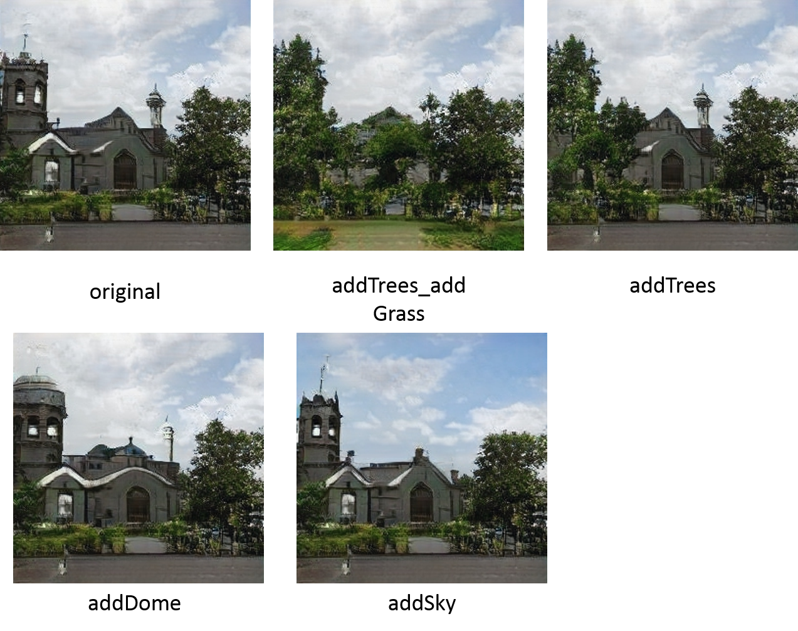
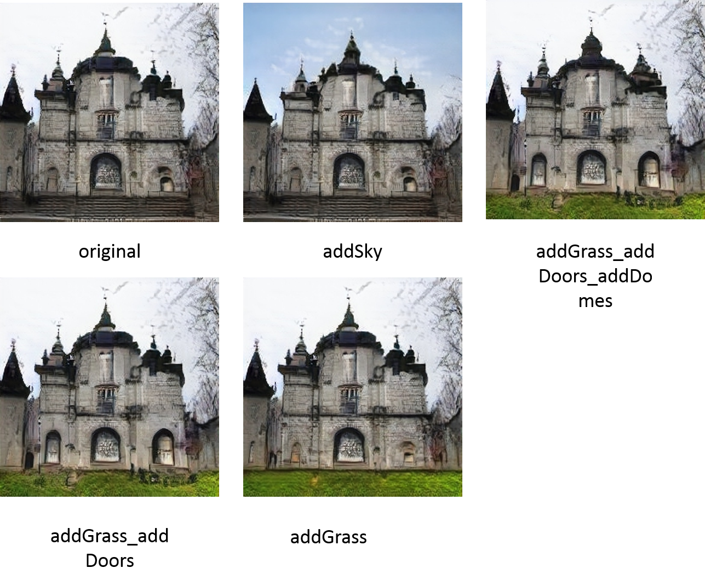
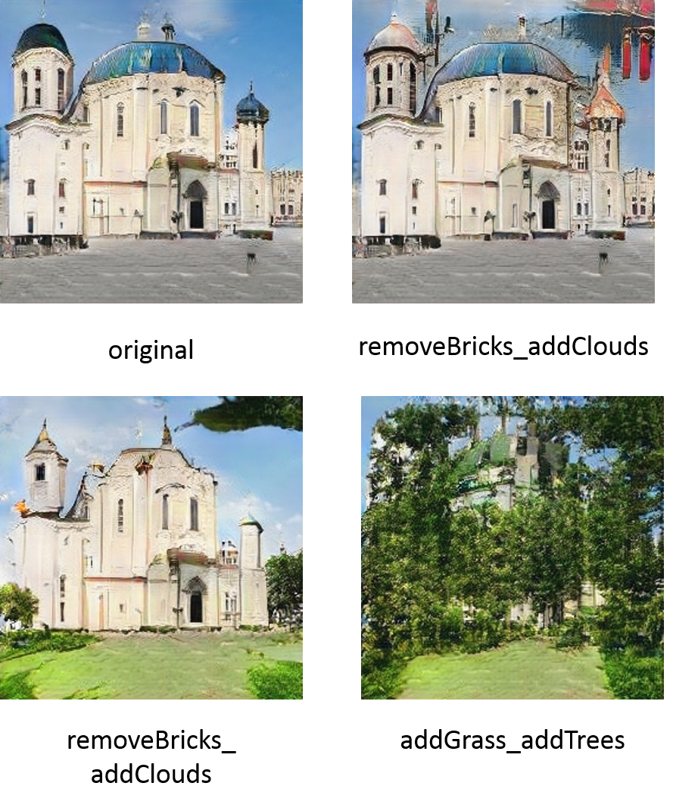
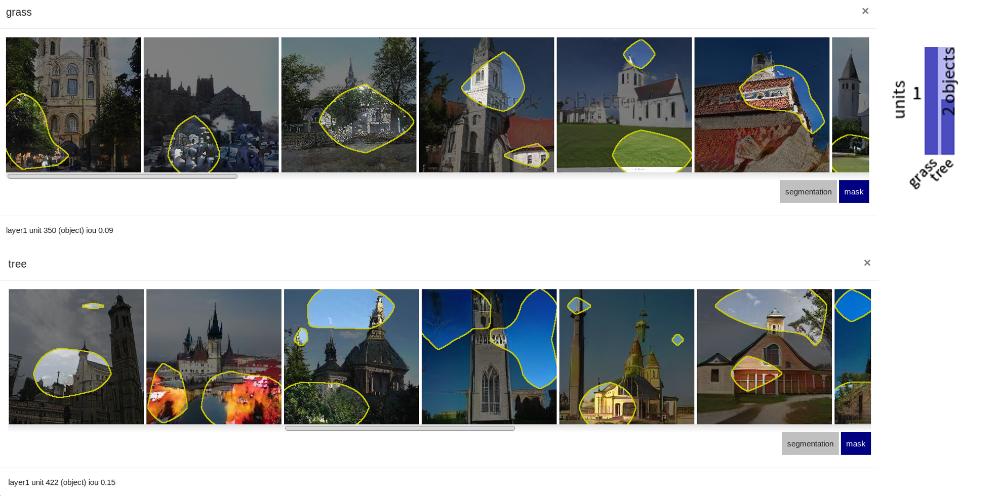
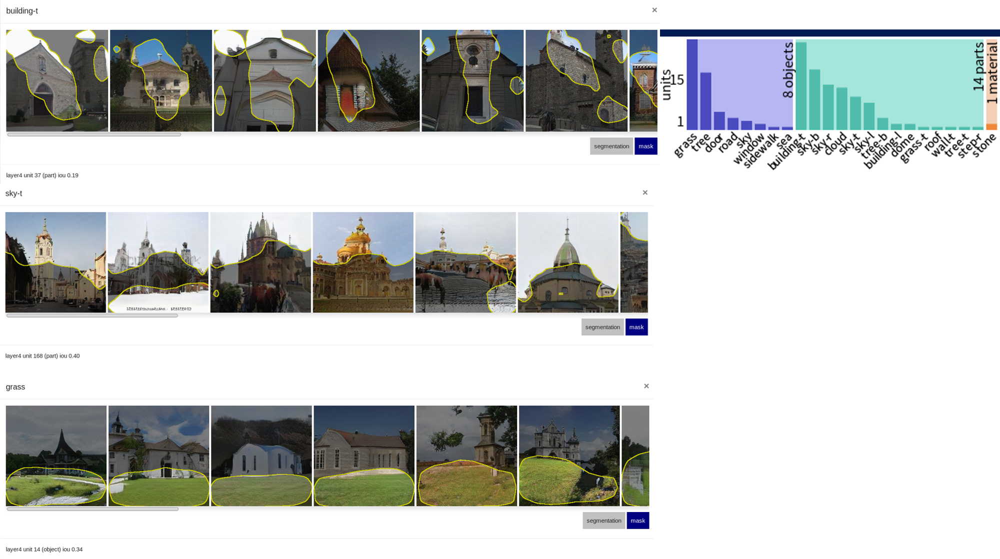
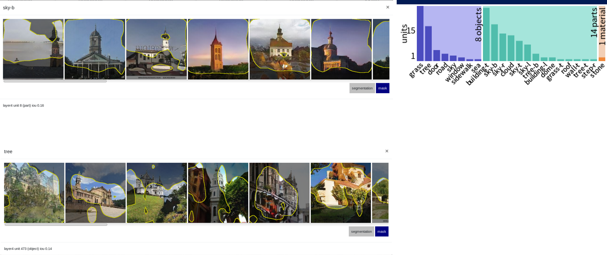
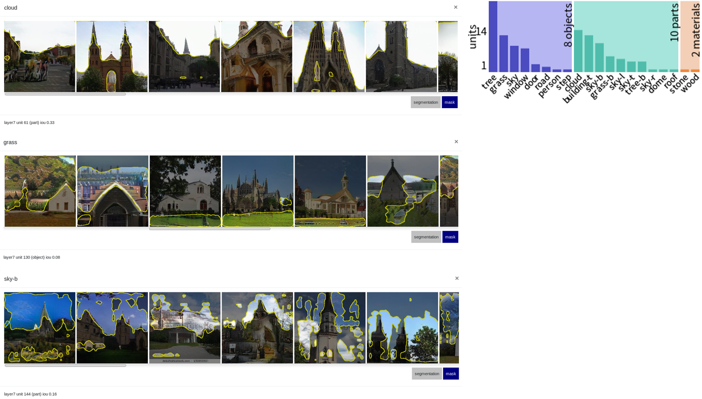
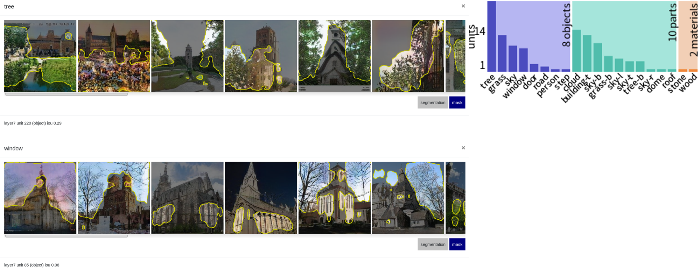

#HW3-GAN-Dissection

## To-Do

1.  使用GANPaint產生圖片
2.  Dissect any GAN model and analyze what you find
3.  Compare with other method


## 1.使用GANPaint產生圖片
## GANDissect介紹 <a href="http://gandissect.res.ibm.com/ganpaint.html?project=churchoutdoor&layer=layer4"></a>

[**專案**](https://gandissect.csail.mit.edu/) | [**Demo**](http://gandissect.res.ibm.com/ganpaint.html?project=churchoutdoor&layer=layer4) | [**論文**](https://arxiv.org/pdf/1811.10597.pdf) | [**影片**](http://tiny.cc/gandissect) <br>

[GAN Dissection](https://gandissect.csail.mit.edu/) is a way to inspect the internal representations of a generative adversarial network (GAN) to understand how internal units align with human-interpretable concepts. It is part of [NetDissect](https://netdissect.csail.mit.edu/).

This repo allows you to dissect a GAN model. It provides the dissection results as a static summary or as an interactive visualization. Try our interactive [GANPaint demo](http://gandissect.res.ibm.com/ganpaint.html?project=churchoutdoor&layer=layer4) to interact with GANs and draw images. 

這個工具是非常有趣的demo，只要鼠標劃過，GAN就可以立即在你指定的地方畫出雲彩、草地、門和樹等景物，並直接改變構圖以保持圖像的「合理性」。選中「draw」功能和特定的對象，如tree，就能在圖中隨意用畫筆塗抹，GAN會在塗抹區域自動生成樹木。選中「remove」功能和特定的對象，如grass，GAN會在塗抹區域自動刪除草地。

GAN paint app的工作原理是直接激活或者去激活深度網絡中的神經元組，這些神經元被訓練用來生成圖像。左邊每個按鈕（如door、brick等）都對應20個神經元。該app表明，通過學習繪畫，GAN網絡還能學習樹、門還有屋頂等對象。通過直接切換神經元，你可以觀察該網絡建模的視覺世界的結構。

我們使用了這個GANPaint工具來玩幾個樣式：

### 樣式1
如最左是我們原始圖片，我們實驗了 addTrees_addGrass, addTrees, addsky, addDome 幾個結果。

### 樣式2
如最左是我們原始圖片，我們實驗了 addGrass_addDoors_addDomes,addGrass_addDoors, addGrass, addsky 幾個結果。

### 樣式3
如最左是我們原始圖片，我們實驗了 removesDomes_addTrees_addGrass_addClouds,removeBricks_addClouds, addGrass_addtrees 幾個結果。


**結論：我們在實驗過程發現，只要是相關性高的元素，Ganpiant會給我們最佳的繪圖效果，例如，當我們要在草地上加樹時，生成的效果最大，但是如果我們要在天空增加樹林，效果生成就不會太大，但是在天空加入雲效果就會非常的好：**


## 2.Dissect any GAN model and analyze what you find
## 大綱介紹


[Visualizing and Understanding Generative Adversarial Networks](http://gandissect.csail.mit.edu) <br>
[David Bau](http://people.csail.mit.eduÂ/davidbau/home/), [Jun-Yan Zhu](http://people.csail.mit.edu/junyanz/), [Hendrik Strobelt](http://hendrik.strobelt.com/), [Bolei Zhou](http://people.csail.mit.edu/bzhou/), [Joshua B. Tenenbaum](http://web.mit.edu/cocosci/josh.html), [William T. Freeman](https://billf.mit.edu/), [Antonio Torralba](http://web.mit.edu/torralba/www/) <br>
MIT CSAIL, MIT-IBM Watson AI Lab, CUHK, IBM Research <br>
In arXiv, 2018.

## 開始安裝（本專案使用church_Outdoor model示範）
Let's set up the environment and dissect a `churchoutdoor` GAN. This requires some CUDA-enabled GPU and some disk space.

### 安裝步驟

To install everything needed from this repo, have `conda` available,
and run:

```
script/setup_env.sh      # Create a conda environment with dependencies
script/make_dirs.sh      # Create the dataset and dissect directories
script/download_data.sh  # Download support data and demo GANs
source activate netd     # Enter the conda environment
pip install -v -e .      # Link the local netdissect package into the env
```

Details.  The code depends on python 3, Pytorch 4.1, and several other
packages.  For conda users, `script/environment.yml` provides the details
of the dependencies.  For pip users, `setup.py` lists everything needed.

Data.  The `download_data.sh` script downloads the segmentation dataset
used to dissect classifiers, the segmentation network used to dissect GANs,
and several example GAN models to dissect.  The downloads will go into
the directories `dataset/` and `models/`.  If you do not wish to download
the example networks, `python -m netdissect --download` will download
just the data and models needed for netdissect itself.


### Dissecting a GAN（我們使用churchoutdoor_model）

GAN example: to dissect three layers of the LSUN living room progressive
GAN trained by Karras:

```
python -m netdissect \
   --gan \
   --model "netdissect.proggan.from_pth_file('models/karras/livingroom_lsun.pth')" \
   --outdir "dissect/livingroom" \
   --layer layer1 layer4 layer7 \
   --size 1000
```

The result is a static HTML page at `dissect/livingroom/dissect.html`, and
a JSON file of metrics at `dissect/livingroom/dissect.json`.

You can test your own model: the `--model` argument is a fully-qualified
python function or constructor for loading the GAN to test.  The
`--layer` names are fully-qualified (`state_dict`-style) names for layers.

By default, a scene-based segmentation is used but a different segmenter class
can be substituted by supplying an alternate class constructor to
`--segmenter`.  See `netdissect/segmenter.py` for the segmenter base class.

## Running a GAN editing server (alpha)


Once a GAN is dissected, you can run a web server that provides an API
that generates images with (optional) interventions.

```
python -m netdissect.server --address 0.0.0.0
```


The editing UI (right) is served at [http://localhost:5001/](http://localhost:5001/) .

Other URLs:

- [http://localhost:5001/api/ui](http://localhost:5001/api/ui) is the OpenAPI/swagger UI for directly
    testing GAN interventions.
- [http://localhost:5001/data/livingroom/dissect.html](http://localhost:5001/data/livingroom/dissect.html) static net
    dissection reports.
- [http://localhost:5001/data/livingroom/edit.html](http://localhost:5001/data/livingroom/edit.html) a dissection-based
    interface for testing interventions.
- TODO: [http://localhost:5001/ganpaint.html](http://localhost:5001/ganpaint.html) will serve GANpaint

成功啟動church_outdoor_model，我們來分析layer1, layer4, layer7 結果ioa（interest of area）狀況：

### layer1層分析
如下圖，我們分析出layer1層的IoA的狀況，在grass及tree兩張圖，ioa的錯誤率是蠻大的，這是因為第一層的狀況仍未訓練出好的參數，導致錯誤率發生極大。


### layer4層分析
如下圖，我們分析出layer4層的IoA的狀況，除了tree其中一張圖沒找到符合的元素外，ioa的情況其實訓練得非常好，幾乎可以找得到我們要的target。


### layer7層分析
如下圖，整體的ioa表現的非常好，該有的目標都有達到（tree, cloud, grass, sky, window），訓練生成的目標達到我們的期望（優於layer1 及 layer4）




## Acknowledgments
Code is from [gandissect](https://github.com/CSAILVision/GANDissect). All credit goes to the authors of [gandissect](https://gandissect.csail.mit.edu/), David Bau, Jun-Yan Zhu, Hendrik Strobelt, Bolei Zhou, Joshua B. Tenenbaum, William T. Freeman and Antonio Torralba.

##reference
參考網頁:[Inpainting](https://github.com/akmtn/pytorch-siggraph2017-inpainting)
