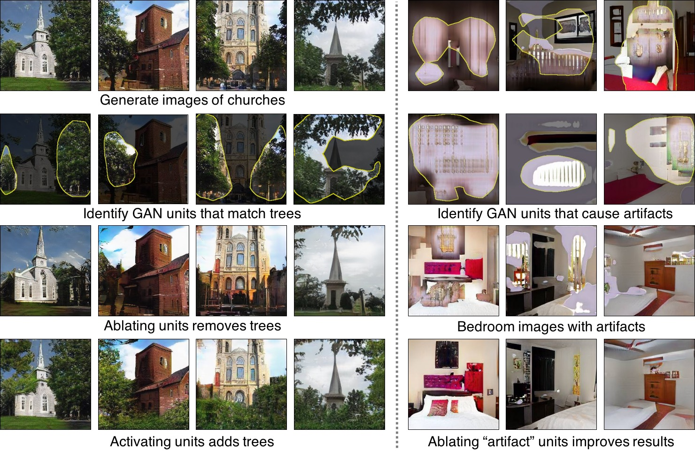

# homework3-GAN-Dissection

## Assign

1.  10% (Generate images with GANPaint)
2.  20% (Dissect any GAN model and analyze what you find)
3.  20% (Compare with other method)
4.  30% (Assistant) 
5.  20% (Mutual evaluation)

reference:

[Inpainting](https://github.com/akmtn/pytorch-siggraph2017-inpainting)

## Introduction - GANDissect <a href="http://gandissect.res.ibm.com/ganpaint.html?project=churchoutdoor&layer=layer4"></a>

[**Project**](https://gandissect.csail.mit.edu/) | [**Demo**](http://gandissect.res.ibm.com/ganpaint.html?project=churchoutdoor&layer=layer4) | [**Paper**](https://arxiv.org/pdf/1811.10597.pdf) | [**Video**](http://tiny.cc/gandissect) <br>
[GAN Dissection](https://gandissect.csail.mit.edu/) is a way to inspect the internal representations of a generative adversarial network (GAN) to understand how internal units align with human-interpretable concepts. It is part of [NetDissect](https://netdissect.csail.mit.edu/).

This repo allows you to dissect a GAN model. It provides the dissection results as a static summary or as an interactive visualization. Try our interactive [GANPaint demo](http://gandissect.res.ibm.com/ganpaint.html?project=churchoutdoor&layer=layer4) to interact with GANs and draw images. 

## Overview



[Visualizing and Understanding Generative Adversarial Networks](http://gandissect.csail.mit.edu) <br>
[David Bau](http://people.csail.mit.eduÂ/davidbau/home/), [Jun-Yan Zhu](http://people.csail.mit.edu/junyanz/), [Hendrik Strobelt](http://hendrik.strobelt.com/), [Bolei Zhou](http://people.csail.mit.edu/bzhou/), [Joshua B. Tenenbaum](http://web.mit.edu/cocosci/josh.html), [William T. Freeman](https://billf.mit.edu/), [Antonio Torralba](http://web.mit.edu/torralba/www/) <br>
MIT CSAIL, MIT-IBM Watson AI Lab, CUHK, IBM Research <br>
In arXiv, 2018.

## Getting Started
Let's set up the environment and dissect a `churchoutdoor` GAN. This requires some CUDA-enabled GPU and some disk space.

### Setup

To install everything needed from this repo, have `conda` available,
and run:

```
script/setup_env.sh      # Create a conda environment with dependencies
script/make_dirs.sh      # Create the dataset and dissect directories
script/download_data.sh  # Download support data and demo GANs
source activate netd     # Enter the conda environment
pip install -v -e .      # Link the local netdissect package into the env
```

Details.  The code depends on python 3, Pytorch 4.1, and several other
packages.  For conda users, `script/environment.yml` provides the details
of the dependencies.  For pip users, `setup.py` lists everything needed.

Data.  The `download_data.sh` script downloads the segmentation dataset
used to dissect classifiers, the segmentation network used to dissect GANs,
and several example GAN models to dissect.  The downloads will go into
the directories `dataset/` and `models/`.  If you do not wish to download
the example networks, `python -m netdissect --download` will download
just the data and models needed for netdissect itself.


### Dissecting a GAN

GAN example: to dissect three layers of the LSUN living room progressive
GAN trained by Karras:

```
python -m netdissect \
   --gan \
   --model "netdissect.proggan.from_pth_file('models/karras/livingroom_lsun.pth')" \
   --outdir "dissect/livingroom" \
   --layer layer1 layer4 layer7 \
   --size 1000
```

The result is a static HTML page at `dissect/livingroom/dissect.html`, and
a JSON file of metrics at `dissect/livingroom/dissect.json`.

You can test your own model: the `--model` argument is a fully-qualified
python function or constructor for loading the GAN to test.  The
`--layer` names are fully-qualified (`state_dict`-style) names for layers.

By default, a scene-based segmentation is used but a different segmenter class
can be substituted by supplying an alternate class constructor to
`--segmenter`.  See `netdissect/segmenter.py` for the segmenter base class.

## Running a GAN editing server (alpha)


Once a GAN is dissected, you can run a web server that provides an API
that generates images with (optional) interventions.

```
python -m netdissect.server --address 0.0.0.0
```


The editing UI (right) is served at [http://localhost:5001/](http://localhost:5001/) .

Other URLs:

- [http://localhost:5001/api/ui](http://localhost:5001/api/ui) is the OpenAPI/swagger UI for directly
    testing GAN interventions.
- [http://localhost:5001/data/livingroom/dissect.html](http://localhost:5001/data/livingroom/dissect.html) static net
    dissection reports.
- [http://localhost:5001/data/livingroom/edit.html](http://localhost:5001/data/livingroom/edit.html) a dissection-based
    interface for testing interventions.
- TODO: [http://localhost:5001/ganpaint.html](http://localhost:5001/ganpaint.html) will serve GANpaint

## Acknowledgments
Code is from [gandissect](https://github.com/CSAILVision/GANDissect). All credit goes to the authors of [gandissect](https://gandissect.csail.mit.edu/), David Bau, Jun-Yan Zhu, Hendrik Strobelt, Bolei Zhou, Joshua B. Tenenbaum, William T. Freeman and Antonio Torralba.
